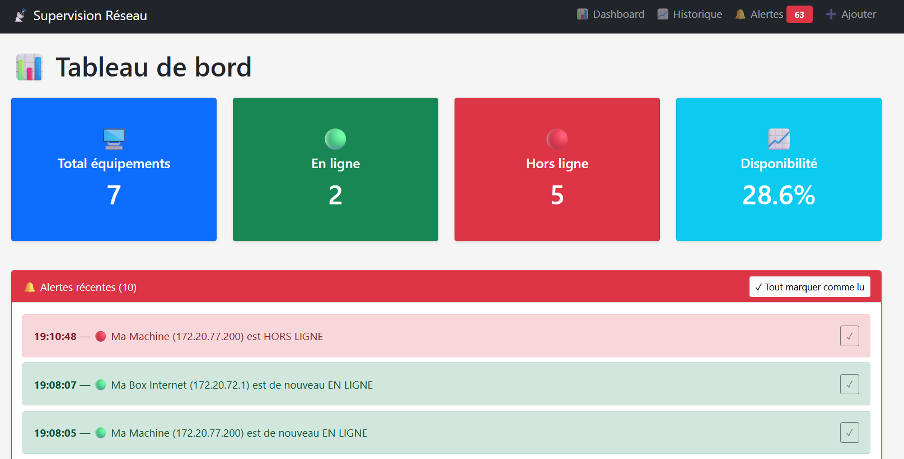
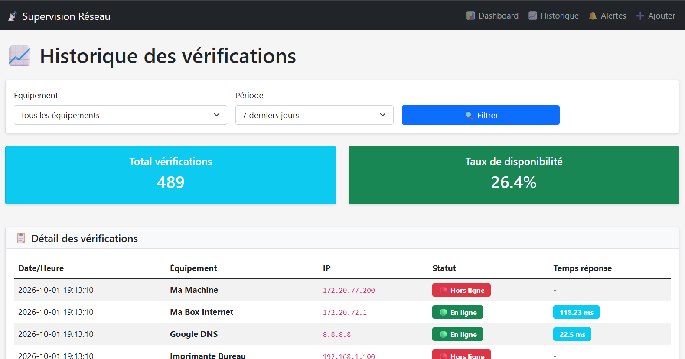
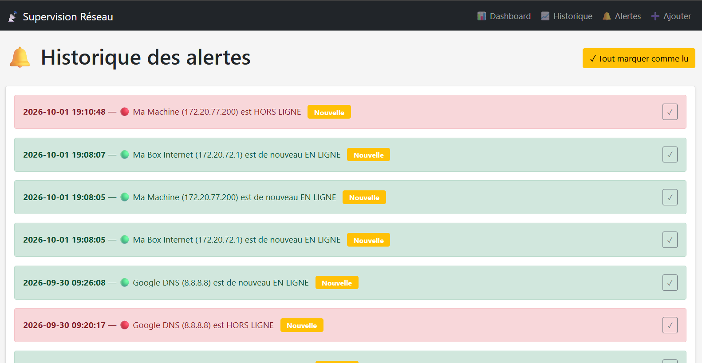

\# Supervision Réseau


Application web de supervision réseau développée en \*\*Python/Flask\*\*. Elle permet de surveiller en temps réel l'état de disponibilité d'équipements réseau (serveurs, routeurs, switches, imprimantes...) via un système de ping intelligent avec fallback TCP.


!\[Python](https://img.shields.io/badge/Python-3.13-blue)

!\[Flask](https://img.shields.io/badge/Flask-3.1-green)

!\[License](https://img.shields.io/badge/License-MIT-yellow)


\---


\## Fonctionnalités


\- \*\*Ping intelligent\*\* : test ICMP + fallback automatique TCP (443 puis 80) pour fonctionner même sur les réseaux qui bloquent l'ICMP

\- \*\*Tableau de bord\*\* : vue d'ensemble avec statistiques (total, en ligne, hors ligne, taux de disponibilité)

\- \*\*Vérification automatique\*\* : scheduler qui vérifie tous les équipements toutes les 5 minutes

\- \*\*Historique\*\* : consultation de toutes les vérifications passées avec filtres (équipement, période)

\- \*\*Alertes\*\* : notification automatique lors des changements d'état (up/down), avec système de lecture

\- \*\*Base de données SQLite\*\* : stockage persistant via SQLAlchemy

\- \*\*Interface moderne\*\* : Bootstrap 5, responsive, badges colorés


\---

## Screenshots

### Tableau de bord


*Vue d'ensemble avec statistiques en temps réel et état des équipements*

### Historique des vérifications


*Consultation de l'historique avec filtres par équipement et période*

### Centre d'alertes


*Notifications automatiques en cas de changement d'état*

---

## Comment ça marche

### Le défi

Dans les environnements d'entreprise, les pare-feux bloquent très souvent les requêtes **ICMP** (le ping classique). Résultat : les outils de supervision traditionnels croient que les équipements sont hors ligne, alors qu'ils fonctionnent parfaitement.

### La solution

Cette application implémente une **stratégie de fallback en cascade** qui teste 3 méthodes dans l'ordre :
```
1. Ping ICMP (1 sec timeout)
├─ ✅ Réponse → EN LIGNE
└─ ❌ Timeout ↓
2. Connexion TCP port 443 (2 sec timeout)
├─ ✅ Connecté → EN LIGNE
└─ ❌ Échec ↓
3. Connexion TCP port 80 (2 sec timeout)
├─ ✅ Connecté → EN LIGNE
└─ ❌ Échec → HORS LIGNE
```

**Résultat :** l'application détecte correctement les équipements même dans les réseaux les plus restrictifs (entreprises, universités, réseaux avec pare-feu strict).

---

## Structure du projet
```
supervision-reseau/
├── app.py # Application Flask (routes + modèles)
├── ping_service.py # Service de ping multicouche (ICMP + TCP)
├── requirements.txt # Dépendances Python
├── README.md
│
├── templates/ # Templates Jinja2
│ ├── base.html # Layout commun
│ ├── dashboard.html # Tableau de bord
│ ├── historique.html # Historique
│ └── alertes.html # Centre d'alertes
│
├── static/ # Assets statiques (CSS, JS)
│
├── docs/
│ └── screenshots/ # Captures d'écran
│
└── instance/
└── supervision.db # Base de données SQLite (auto-générée)
```
---


\## Stack technique


| Composant | Technologie |

|-----------|-------------|

| \*\*Langage\*\* | Python 3.13 |

| \*\*Framework web\*\* | Flask 3.1 |

| \*\*Base de données\*\* | SQLite + SQLAlchemy |

| \*\*Scheduler\*\* | `schedule` |

| \*\*Templates\*\* | Jinja2 + Bootstrap 5 |

| \*\*Ping\*\* | `subprocess` (ICMP) + `socket` (TCP) |

\---

## Installation

### Prérequis

- Python **3.10+**
- pip
- Git

### Étapes

```bash
# 1. Cloner le projet
git clone https://github.com/A-SIDIKI/supervision-reseau.git
cd supervision-reseau

# 2. Créer un environnement virtuel
python -m venv venv

# Windows
venv\Scripts\activate

# Mac/Linux
source venv/bin/activate

# 3. Installer les dépendances
pip install -r requirements.txt

# 4. Lancer l'application
python app.py
```

L'application est accessible sur : **http://127.0.0.1:5000**

